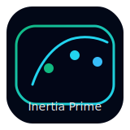

# Inertia Prime

<!-- Logo placeholder -->
<p align="center">
  
</p>

<p align="center">
  <strong>Production-ready React components built for Laravel + Inertia.js.</strong>
</p>

<p align="center">
  <a href="https://www.npmjs.com/package/@inertia-prime/react"></a>
  <a href="https://packagist.org/packages/inertia-prime/laravel"></a>
  <a href="#"></a>
  <a href="LICENSE"></a>
</p>

> Think of Inertia Prime as what **shadcn/ui** is for Next.js, but purpose-built for **Laravel + Inertia.js + React**.

> 🚀 **v0.1.0** – All components are fully implemented and ready for production use!

## Why Inertia Prime?

Laravel + Inertia + React is a powerful stack, but most React component libraries don’t understand:

- **Server-driven state** coming from Laravel controllers and Inertia responses.
- **Laravel validation** errors and form handling.
- **URL-based state** as the source of truth for filters, sorting, and UI state.

Inertia Prime ships components and hooks designed from the ground up for this ecosystem so you can:

- Stop re-building the same tables, forms, and modals on every project.
- Avoid glue code between generic React libs and Inertia’s router.
- Keep filters, sorting, pagination, and modals in sync with the **URL** automatically.

## Features at a Glance

- **🧮 DataTable** – Server-side sorting/filtering, URL-synced state, bulk actions, responsive layout.
- **📄 Forms** – Inertia-aware forms with Laravel error binding, dirty-state tracking, optimistic UIs.
- **🪟 Modals & SlideOvers** – Open/close driven by URL, back-button aware, focus-managed.
- **🧭 Navigation** – Tabs, breadcrumbs, and pagination aligned with Inertia routing.
- **⚡ Hooks layer** – Headless `useInertiaTable`, `useInertiaForm`, `useUrlState`, `useInfiniteScroll`, `useModal`.
- **🎨 Tailwind-first styling** – Beautiful defaults + headless variants when you want full control.
- **♿ Accessibility** – ARIA attributes, keyboard navigation, and focus management built-in.

> URL is the source of truth. Server is the source of data. React is the view.

## Quick Start

### 1. Install packages

```bash
# Frontend: React component library
npm install @inertia-prime/react @inertiajs/react react react-dom

# or with pnpm
deps="@inertia-prime/react @inertiajs/react react react-dom"
pnpm add $deps

# Backend: Laravel integration package
composer require inertia-prime/laravel
```

### 2. Laravel auto-discovery

The Laravel package auto-registers via `composer.json` — no manual provider registration required.

Optionally publish the config file:

```bash
php artisan vendor:publish --tag=inertia-prime-config
```

### 3. Use the DataTable in a page


**Controller:**

```php
// app/Http/Controllers/UserController.php

use Inertia\Inertia;
use InertiaPrime\Support\TableBuilder;

class UserController
{
    public function index()
    {
        $table = TableBuilder::for(User::query())
            ->columns([
                'name',
                'email',
                'created_at',
            ])
            ->defaultSort('created_at', 'desc')
            ->applyRequest(request());

        return Inertia::render('Users/Index', [
            'table' => $table->toResponse(),
        ]);
    }
}
```

**Inertia React page:**

```tsx
// resources/js/Pages/Users/Index.tsx

import { Head } from '@inertiajs/react';
import { DataTable } from '@inertia-prime/react';
// [TODO] Actual API of useInertiaTable will be finalized later
import { useInertiaTable } from '@inertia-prime/react/hooks';

interface User {
  id: number;
  name: string;
  email: string;
  created_at: string;
}

interface Props {
  table: unknown; // [TODO] Replace with Inertia Prime table response type
}

export default function Index({ table }: Props) {
  const inertiaTable = useInertiaTable<User>({
    resource: table,
    route: route('users.index'),
  });

  return (
    <>
      <Head title="Users" />

      <DataTable
        {...inertiaTable}
        // Common features handled for you:
        // - Server-side pagination, sorting, and filters
        // - URL-synced state (including search, page, and column sorting)
        // - Empty and loading states
        // - Bulk row selection and actions
      />
    </>
  );
}
```

## Component Library

### Data Display

- **DataTable** – Server-side table with sorting, filters, pagination, selection, export, and URL state.
- **InfiniteList** – Virtualized infinite scrolling with scroll restoration and skeleton loaders.
- **DescriptionList** – Key-value display for detail views with responsive layouts.

### Forms

- **Form** – Wrapper for `useInertiaForm` with validation/errors and dirty state.
- **TextField**
- **TextArea**
- **Select**
- **Combobox**
- **AsyncSelect**
- **Checkbox** / **CheckboxGroup**
- **RadioGroup**
- **Switch**
- **DatePicker**
- **FileUpload**

### Overlays & Popovers

- **Modal**
- **SlideOver**
- **Dropdown**
- **Popover**
- **Tooltip**

### Navigation

- **Tabs** (URL-aware)
- **Breadcrumbs**
- **Pagination** (Laravel paginator integration)
- **CommandPalette**

### Feedback

- **Toast**
- **Alert**
- **Progress** / **CircularProgress**
- **Skeleton** family

### Layout & Misc

- **Card**
- **EmptyState**
- **Divider**
- **DescriptionList**

### Hooks (Headless Logic)

- **useInertiaTable** – Core table state + URL sync.
- **useInertiaForm** – Enhancements around Inertia’s `useForm`.
- **useUrlState** – Generic URL query ↔ React state sync.
- **useModal** – URL-driven modal state.
- **useInfiniteScroll** – IntersectionObserver-powered infinite loading.

> [TODO] See `apps/docs` for detailed reference once components are implemented.

## Before vs After Inertia Prime

|                                   | Before Inertia Prime                                        | After Inertia Prime                                                          |
| --------------------------------- | ----------------------------------------------------------- | ---------------------------------------------------------------------------- |
| **Data tables**                   | Custom glue around paginator, query params, and filters    | Drop-in `<DataTable />` with URL, paginator, and filters wired for you      |
| **Forms**                         | Manual mapping of Laravel errors into generic components    | `Form`, `TextField`, etc. understand Inertia + Laravel out of the box       |
| **URL state**                     | Ad-hoc `useEffect` and manual query string parsing         | `useUrlState` and table/form hooks keep everything in sync automatically    |
| **Modals & slide-overs**         | Local state; back button breaks, state lost on refresh     | URL-driven overlays that work with history and survive refresh              |
| **Server vs client data**        | Sorting/filtering sometimes done twice (JS + SQL)          | Server-first: Eloquent is the single source of truth                         |
| **Team onboarding**              | Each project has custom table/form glue to learn           | Shared patterns documented and reusable across projects                      |

## Documentation & Examples

- **Docs:** [TODO: documentation URL]
- **Examples & Recipes:** `apps/docs/src/pages/examples`
- **Playground app:** `apps/playground` – a full Laravel + Inertia + React sandbox.

## Built for the Laravel Ecosystem

Inertia Prime embraces Laravel conventions:

- Request/response helpers for Eloquent-powered tables.
- Validation error structures that match Laravel’s defaults.
- Paginator integration using `LengthAwarePaginator` responses.
- Artisan commands to scaffold common patterns (e.g. `php artisan make:inertia-table UsersTable`).

If you are comfortable with Laravel and Inertia, Inertia Prime should feel **natural**, not foreign.

## Component Status

### ✅ All Components Implemented (v0.1.0)

| Category | Components |
|----------|------------|
| **Hooks (12)** | `useDebounce`, `useUrlState`, `useModal`, `useInertiaTable`, `useInertiaForm`, `useToast`, `useFocusTrap`, `useClickOutside`, `useKeyboard`, `useScrollLock`, `useMediaQuery`, `useInfiniteScroll` |
| **Data Display** | `DataTable`, `Card`, `Alert`, `Skeleton`, `EmptyState`, `Progress`, `CircularProgress`, `Divider`, `DescriptionList` |
| **Forms** | `Form`, `FormField`, `FormLabel`, `FormDescription`, `FormMessage`, `TextField`, `Select`, `Checkbox`, `Textarea`, `Switch`, `RadioGroup`, `CheckboxGroup`, `Combobox`, `AsyncSelect`, `DatePicker`, `FileUpload`, `Button` |
| **Overlays** | `Modal`, `SlideOver`, `Dropdown`, `Popover`, `Tooltip`, `ToastProvider` |
| **Navigation** | `Tabs`, `Breadcrumbs`, `Pagination`, `InfiniteList`, `CommandPalette` |
| **Laravel** | `TableBuilder`, `FilterParser`, `SendsToastNotifications`, Artisan commands |

## Contributing

We welcome issues, pull requests, and discussions.

- Read the **[CONTRIBUTING](CONTRIBUTING.md)** guide for local setup.
- Check **[apps/playground](apps/playground)** for end-to-end manual testing.
- Open issues for API design questions early – we want the APIs to feel “Laravel-native”.

## Credits

- Inspired by **Laravel**, **Inertia.js**, **shadcn/ui**, and the broader React/Laravel communities.
- Maintainers: [TODO: add maintainers]

## License

Inertia Prime is open-sourced software licensed under the **[MIT license](LICENSE)**.
